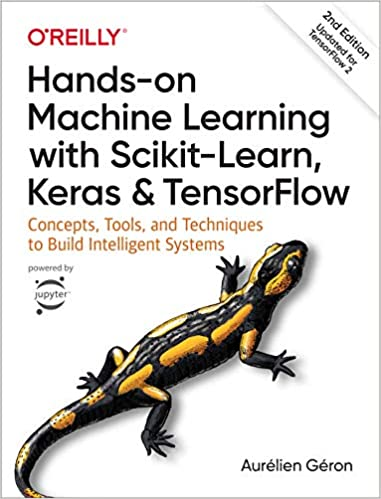

# susu-python-packages-notes

一些常用 Python 第三方库的学习笔记.

## 介绍

- [01_learn_pandas.ipynb](./01_learn_pandas.ipynb): 十分钟入门 **Pandas**, 原教程地址: https://www.pypandas.cn/docs/getting_started/10min.html .

- [02_classification.ipynb](./02_classification.ipynb): Hands-on Machine Learning with Scikit-Learn, Keras and TensorFlow (the second edition) 的第 3 章 分类的 Notebook, 原教程地址: https://github.com/ageron/handson-ml2/blob/master/03_classification.ipynb .

- [03_learn_pandas_iteration.ipynb](./03_learn_pandas_iteration.ipynb): 介绍 **Pandas** 的迭代器, 原教程地址: https://www.pypandas.cn/docs/getting_started/basics.html#%E8%BF%AD%E4%BB%A3 .

## Reference

[1] [十分钟入门 Pandas](https://www.pypandas.cn/docs/getting_started/10min.html).

[2] [handson-ml2](https://github.com/ageron/handson-ml2).

[3] [Pandas 迭代](https://www.pypandas.cn/docs/getting_started/basics.html#%E8%BF%AD%E4%BB%A3).
                                              
